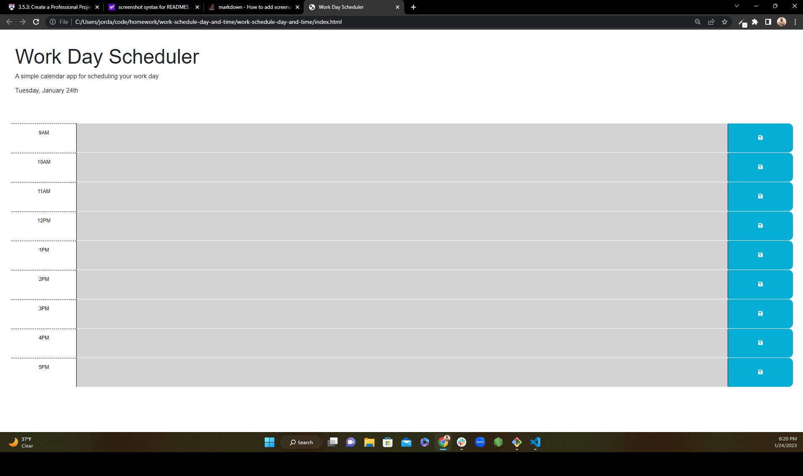

# work-schedule-day-and-time

## Description

The motivation for this assignment was to implement new code techniques and to apply them to past concepts. More specifically to cement hwo to use jquery within code and how to continure to use local storage for projects. I made this project to figure out creative ways to use jquery and have it interact with the page in real-time. It solves the problem on how to keep an organized schedule and time mangement. The biggest lesson I learned from this project to come better prepared for tutoring session.

## License

Liscense.MIT

---

## Screenshots

## Links

Github - https://github.com/JustGritJordan/work-schedule-day-and-time

Website -
